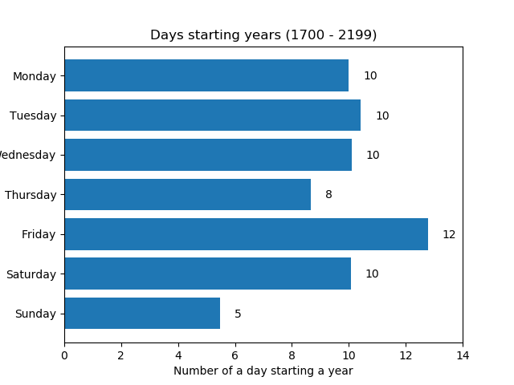

# Python hands-on exam 

This exam will check the basic knowledge of Python during the course Introduction to Data Science. The underlying exam idea taken from [the Medium.com post](https://medium.com/cantors-paradise/how-to-perform-calendar-calculations-5617f35d3070).

Update the marked parts in this document with your answers.

## 1. Environment setup

Before you start working on the task, create an empty environment (e.g. using conda or virtualenv) which you will use for the tasks below. Also, create an empty Jupyter notebook using the Python from your environment.

```
TODO: Add here all the commands you needed to enter to set up the environment.
conda create -n exam2 python=3.13
conda activate exam2
pip intall jupyter
# add the interpreter to PyCharm
# run the Jupyter notebook
```

**TODO: Add a screenshot of a running Jupyter notebook from which a selection of a correct Python kernel is visible (e.g. a selection of multiple possible kernels).**
Screenshot

## 2. Perform Calendar Calculations "in Your Head"

Which day of week was the 7th June 1987?

It was **TODO: put your answer here, when you implement the functions below.** Sunday

Calendar calculations are actually very simple to perform and can be learned in less than 30 minutes. Instead learning how to perform them "in your head" you will need to implement them within the Jupyter notebook you created above.

### 2.1 Calculate the Year code (Y)

Create a function that will calculate the year code (Y).

Procedure: Take the last two digits of the year, divide by 4 and remove the remainder. Add the number to the last two digits of the year:

* For dates in the 1700s, add 4.
* For dates in the 1800s, add 2.
* For dates in the 1900s, add 0.
* For dates in the 2000s, add 6.
* For dates in the 2100s, add 4.

> For example, year 1989: `89 / 4 = 22` and `22 + 89 + 0 = 111 = Y`

### 2.2 Select the Month code (M)

Create a function that will calculate the month code (M). Get the month code from the following lookup table (use an appropriate structure to store lookup tables):

|Month|Code|
|---|---|
|January     | 1 or 0 (for a leap year) |
|February    | 4 or 3 (for a leap year) |
|March       | 4 |
|April       | 0 |
|May         | 2 |
|June        | 5 |
|July        | 0 |
|August      | 3 |
|September   | 6 |
|October     | 1 |
|November    | 4 |
|December    | 6 |

Hint: Leap years occur every four years (even years). Century years (e.g. 1900, 2000 or 2100) are leap years if they are evenly divisible by 400.

> For example: For January 1989 we obtain the month code `1 = M`

### 2.3 Find the day of the week.

The day code (D) is just the number of the day in a month.

> For example: January 13 has the day code `13 = D`

Create a function that will return the day of the week for a given date. Input date should be represented as three separate integers (day, month, year).

To calculate the day of the week, add Y, M and D together. Then calculate the remainder of the modulo with 7. Select the day of the week from the following lookup table:

|Day|Remainder|
|---|---|
| Saturday | 0 |
| Sunday | 1 |
| Monday | 2 |
| Tuesday | 3 |
| Wednesday | 4 |
| Thursday | 5 |
| Friday | 6 |

> For example: 13th January 1989 - `Y + M + D = 125`

Select a date and find out what day of the week was that day: 
  
On **TODO: DATE** 8/11/2025 it was **TODO: DAY\_OF\_WEEK** Saturday.

On 11th September 2001 it was **TODO: DAY\_OF\_WEEK** Tuesday.

## 3. First days of years distribution

We know how to calculate the day of week for a given date. For each year from 1700 to 2199 (inclusive) get the day of week for 1st January and present the counts in a horizontal bar plot (e.g. using matplotlib).

The plot should be generated programatically within the Jupyter notebook and saved as a file named *days\_starting\_year\_distribution.png*.

Your plot should look similar to the following one (take care of axis naming, title and numbers):



Resulting plot:

**TODO: show the "*days\_starting\_year\_distribution.png*" here**


## 4. Export calendar data

We will soon enter into the new year 2022. To print new calendars, we need to provide all the dates and days of week to the printing house.

Use the functions from above and generate a CSV file with a header which looks as follows:

```
Day,Month,Year,Day of week
1,January,2022,Saturday
2,January,2022,Sunday
.....
31,December,2022,Saturday
```

Take into account the Gregorian calendar consists of the following 12 months:

|Month|Days in month|
|---|---|
| January | 31 |
| February | 28 or 29 (leap years) |
| March | 31 |
| April | 30 |
| May | 31 |
| June | 30 |
| July | 31 |
| August | 31 |
| September | 30 |
| October | 31 |
| November | 30 |
| December | 31 |

Implement a function which will take a year number as input and then generate and save a CSV file to `days_YEAR.csv`. Save the file for year 2022 into the repository.

> For example: For a year 2022, you will generate a file `days_2022.csv`.

## 5. Make your work reproducible

During your work you may have used some libraries that need to be installed prior running your code. Export a list of your dependencies into the *environment.yml* (or *requirements.txt*) file and add it to the repository.

Update the file in a way that your libraries could be automatically installed in multiple operating systems.

## 6. Double-check your submitted work

Go through the instructions again and make sure that you implemented everything as requested and also pushed everything to the remote repository. Especially check the following:

* Your code works in general.
* You updated all the marked parts of this *README.md*.
* You added Jupyter notebook, `days_starting_year_distribution.png`, `days_2020.csv` and dependencies file to the repo.
